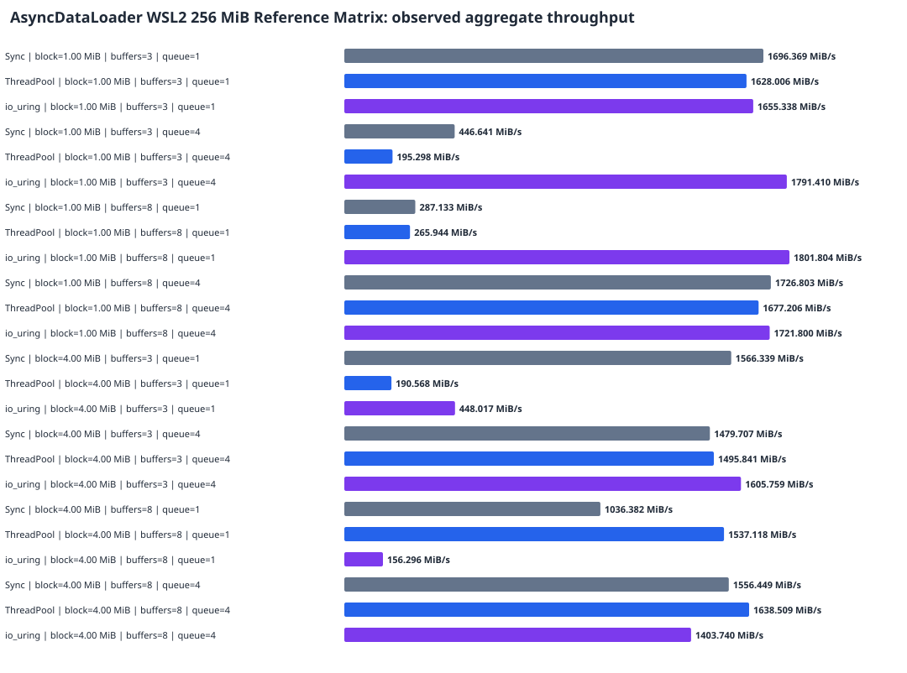
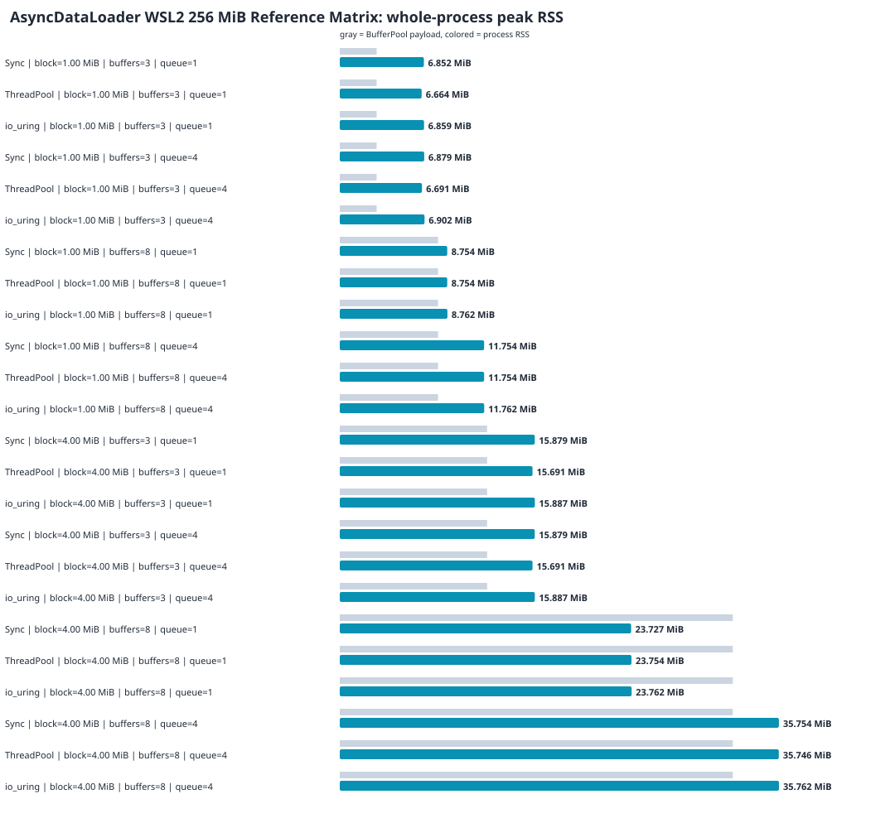

# AsyncDataLoader WSL2 256 MiB Reference Matrix

This report describes validated observations from the recorded environment. It does not claim a universal backend ranking or infer causes from timing alone.

## Dataset

- Environment ID: `wsl2-i7-12800hx-ext4-release-3ba60cd-20260810`
- Raw samples: 120
- Exact configuration groups: 24
- Minimum samples used for findings: 5
- Sources: `/tmp/asyncdataloader-stage11-reference-3ba60cd/raw/parameter-matrix.csv`

## Results

| Input | Requested -> selected | Block | Buffers | Queue | Samples | Avg ms | P95 ms | MiB/s | Max RSS MiB | vs Sync | RSS limit |
|---|---|---:|---:|---:|---:|---:|---:|---:|---:|---:|---|
| input-256m.bin | Sync -> Sync | 1.00 MiB | 3 | 1 | 5 | 150.911 | 188.972 | 1696.369 | 6.85 | 1.000x | passed |
| input-256m.bin | ThreadPool -> ThreadPool | 1.00 MiB | 3 | 1 | 5 | 157.248 | 203.652 | 1628.006 | 6.66 | 0.960x | passed |
| input-256m.bin | io_uring -> io_uring | 1.00 MiB | 3 | 1 | 5 | 154.651 | 164.007 | 1655.338 | 6.86 | 0.976x | passed |
| input-256m.bin | Sync -> Sync | 1.00 MiB | 3 | 4 | 5 | 573.167 | 2290.103 | 446.641 | 6.88 | 1.000x | passed |
| input-256m.bin | ThreadPool -> ThreadPool | 1.00 MiB | 3 | 4 | 5 | 1310.817 | 5940.435 | 195.298 | 6.69 | 0.437x | passed |
| input-256m.bin | io_uring -> io_uring | 1.00 MiB | 3 | 4 | 5 | 142.904 | 148.287 | 1791.410 | 6.90 | 4.011x | passed |
| input-256m.bin | Sync -> Sync | 1.00 MiB | 8 | 1 | 5 | 891.574 | 3852.311 | 287.133 | 8.75 | 1.000x | passed |
| input-256m.bin | ThreadPool -> ThreadPool | 1.00 MiB | 8 | 1 | 5 | 962.610 | 4245.648 | 265.944 | 8.75 | 0.926x | passed |
| input-256m.bin | io_uring -> io_uring | 1.00 MiB | 8 | 1 | 5 | 142.080 | 144.248 | 1801.804 | 8.76 | 6.275x | passed |
| input-256m.bin | Sync -> Sync | 1.00 MiB | 8 | 4 | 5 | 148.251 | 151.571 | 1726.803 | 11.75 | 1.000x | passed |
| input-256m.bin | ThreadPool -> ThreadPool | 1.00 MiB | 8 | 4 | 5 | 152.635 | 162.931 | 1677.206 | 11.75 | 0.971x | passed |
| input-256m.bin | io_uring -> io_uring | 1.00 MiB | 8 | 4 | 5 | 148.682 | 161.667 | 1721.800 | 11.76 | 0.997x | passed |
| input-256m.bin | Sync -> Sync | 4.00 MiB | 3 | 1 | 5 | 163.438 | 172.565 | 1566.339 | 15.88 | 1.000x | passed |
| input-256m.bin | ThreadPool -> ThreadPool | 4.00 MiB | 3 | 1 | 5 | 1343.353 | 6086.347 | 190.568 | 15.69 | 0.122x | passed |
| input-256m.bin | io_uring -> io_uring | 4.00 MiB | 3 | 1 | 5 | 571.407 | 2202.907 | 448.017 | 15.89 | 0.286x | passed |
| input-256m.bin | Sync -> Sync | 4.00 MiB | 3 | 4 | 5 | 173.007 | 236.535 | 1479.707 | 15.88 | 1.000x | passed |
| input-256m.bin | ThreadPool -> ThreadPool | 4.00 MiB | 3 | 4 | 5 | 171.141 | 232.475 | 1495.841 | 15.69 | 1.011x | passed |
| input-256m.bin | io_uring -> io_uring | 4.00 MiB | 3 | 4 | 5 | 159.426 | 169.899 | 1605.759 | 15.89 | 1.085x | passed |
| input-256m.bin | Sync -> Sync | 4.00 MiB | 8 | 1 | 5 | 247.013 | 536.223 | 1036.382 | 23.73 | 1.000x | passed |
| input-256m.bin | ThreadPool -> ThreadPool | 4.00 MiB | 8 | 1 | 5 | 166.545 | 180.587 | 1537.118 | 23.75 | 1.483x | passed |
| input-256m.bin | io_uring -> io_uring | 4.00 MiB | 8 | 1 | 5 | 1637.918 | 7483.876 | 156.296 | 23.76 | 0.151x | passed |
| input-256m.bin | Sync -> Sync | 4.00 MiB | 8 | 4 | 5 | 164.477 | 171.649 | 1556.449 | 35.75 | 1.000x | passed |
| input-256m.bin | ThreadPool -> ThreadPool | 4.00 MiB | 8 | 4 | 5 | 156.240 | 160.856 | 1638.509 | 35.75 | 1.053x | passed |
| input-256m.bin | io_uring -> io_uring | 4.00 MiB | 8 | 4 | 5 | 182.370 | 229.463 | 1403.740 | 35.76 | 0.902x | passed |





Aggregate throughput is total group bytes divided by total group time. Peak RSS is the maximum for the whole process, not BufferPool memory alone.

## Same-configuration observations

- For input=input-256m.bin, block=1.00 MiB, buffers=3, queue=1, the fastest observed mechanism was **Sync** at 1696.369 MiB/s (1.042x the slowest observed mechanism).
- For input=input-256m.bin, block=1.00 MiB, buffers=3, queue=4, the fastest observed mechanism was **io_uring** at 1791.410 MiB/s (9.173x the slowest observed mechanism).
- For input=input-256m.bin, block=1.00 MiB, buffers=8, queue=1, the fastest observed mechanism was **io_uring** at 1801.804 MiB/s (6.775x the slowest observed mechanism).
- For input=input-256m.bin, block=1.00 MiB, buffers=8, queue=4, the fastest observed mechanism was **Sync** at 1726.803 MiB/s (1.030x the slowest observed mechanism).
- For input=input-256m.bin, block=4.00 MiB, buffers=3, queue=1, the fastest observed mechanism was **Sync** at 1566.339 MiB/s (8.219x the slowest observed mechanism).
- For input=input-256m.bin, block=4.00 MiB, buffers=3, queue=4, the fastest observed mechanism was **io_uring** at 1605.759 MiB/s (1.085x the slowest observed mechanism).
- For input=input-256m.bin, block=4.00 MiB, buffers=8, queue=1, the fastest observed mechanism was **ThreadPool** at 1537.118 MiB/s (9.835x the slowest observed mechanism).
- For input=input-256m.bin, block=4.00 MiB, buffers=8, queue=4, the fastest observed mechanism was **ThreadPool** at 1638.509 MiB/s (1.167x the slowest observed mechanism).

## Counterintuitive findings

- io_uring was not the fastest observed mechanism for input=input-256m.bin, block=4.00 MiB, buffers=3, queue=1; Sync measured 1566.339 versus 448.017 MiB/s. No cause is claimed without system-level evidence.
- io_uring was not the fastest observed mechanism for input=input-256m.bin, block=4.00 MiB, buffers=8, queue=1; ThreadPool measured 1537.118 versus 156.296 MiB/s. No cause is claimed without system-level evidence.
- io_uring was not the fastest observed mechanism for input=input-256m.bin, block=4.00 MiB, buffers=8, queue=4; ThreadPool measured 1638.509 versus 1403.740 MiB/s. No cause is claimed without system-level evidence.

## Evidence boundaries

- Every accepted row passed output verification and its queue/in-flight bounds.
- Groups below the finding threshold: 0.
- Groups with an RSS-limit failure: 0.
- Auto rows record fallback policy behavior. They are not ranked as a fourth I/O mechanism.
- The CSV cannot explain a performance cause. Profile the exact same command first:

```bash
strace -f -c -o strace-summary.txt -- <exact pipeline command>
perf stat -r 5 -o perf-stat.txt -- <exact pipeline command>
```

The current reader has one read request outstanding. Handoff queue depth must not be described as io_uring submission-depth scaling. Coroutines organize suspension and resumption; they are not themselves a speedup source.
