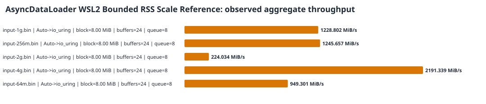
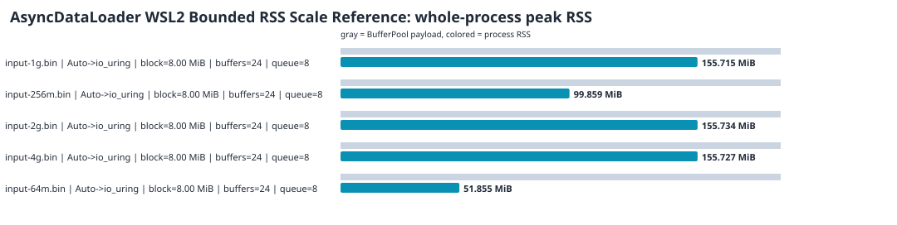

# AsyncDataLoader WSL2 Bounded RSS Scale Reference

This report describes validated observations from the recorded environment. It does not claim a universal backend ranking or infer causes from timing alone.

## Dataset

- Environment ID: `wsl2-i7-12800hx-ext4-release-3ba60cd-20260810`
- Raw samples: 5
- Exact configuration groups: 5
- Minimum samples used for findings: 1
- Sources: `/tmp/asyncdataloader-stage11-reference-3ba60cd/raw/rss-scale-64m.csv`, `/tmp/asyncdataloader-stage11-reference-3ba60cd/raw/rss-scale-256m.csv`, `/tmp/asyncdataloader-stage11-reference-3ba60cd/raw/rss-scale-1g.csv`, `/tmp/asyncdataloader-stage11-reference-3ba60cd/raw/rss-scale-2g.csv`, `/tmp/asyncdataloader-stage11-reference-3ba60cd/raw/rss-scale-4g.csv`

## Results

| Input | Requested -> selected | Block | Buffers | Queue | Samples | Avg ms | P95 ms | MiB/s | Max RSS MiB | vs Sync | RSS limit |
|---|---|---:|---:|---:|---:|---:|---:|---:|---:|---:|---|
| input-1g.bin | Auto -> io_uring | 8.00 MiB | 24 | 8 | 1 | 833.332 | 833.332 | 1228.802 | 155.71 | n/a | passed |
| input-256m.bin | Auto -> io_uring | 8.00 MiB | 24 | 8 | 1 | 205.514 | 205.514 | 1245.657 | 99.86 | n/a | passed |
| input-2g.bin | Auto -> io_uring | 8.00 MiB | 24 | 8 | 1 | 9141.480 | 9141.480 | 224.034 | 155.73 | n/a | passed |
| input-4g.bin | Auto -> io_uring | 8.00 MiB | 24 | 8 | 1 | 1869.177 | 1869.177 | 2191.339 | 155.73 | n/a | passed |
| input-64m.bin | Auto -> io_uring | 8.00 MiB | 24 | 8 | 1 | 67.418 | 67.418 | 949.301 | 51.86 | n/a | passed |





Aggregate throughput is total group bytes divided by total group time. Peak RSS is the maximum for the whole process, not BufferPool memory alone.

## Same-configuration observations

- No exact config had two adequately sampled explicit backends.

## Counterintuitive findings

- No io_uring reversal crossed the 3% reporting threshold. This does not prove that counterintuitive behavior is absent.

## Evidence boundaries

- Every accepted row passed output verification and its queue/in-flight bounds.
- Groups below the finding threshold: 0.
- Groups with an RSS-limit failure: 0.
- Auto rows record fallback policy behavior. They are not ranked as a fourth I/O mechanism.
- The CSV cannot explain a performance cause. Profile the exact same command first:

```bash
strace -f -c -o strace-summary.txt -- <exact pipeline command>
perf stat -r 5 -o perf-stat.txt -- <exact pipeline command>
```

The current reader has one read request outstanding. Handoff queue depth must not be described as io_uring submission-depth scaling. Coroutines organize suspension and resumption; they are not themselves a speedup source.
